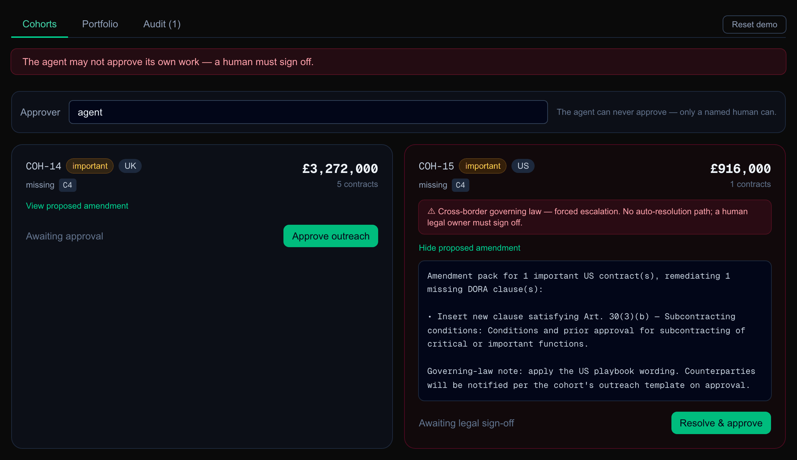

<div align="center">

# RegProof

### Finds the contracts a new regulation has made out of date

**Thousands of signed contracts are suddenly non-compliant, and nobody has read them all.**
**RegProof finds them, drafts the fix, and sends nothing until a named person signs it off.**

<br/>

[](./docs/hero.png)

**A real run of the app.** Two of the fifteen groups. The name "agent" was typed as the approver, and the app said no.
[The thirty-second version](#the-thirty-second-version) · [Run it yourself](#quick-start)

<br/>

[](./LICENSE)
[](./tests)
[](https://github.com/patkusch/regproof/actions/workflows/ci.yml)
[](https://nextjs.org/)

</div>

---

## The thirty-second version

A bank has 240 signed supplier contracts. The EU rule DORA came into force on 17 January 2025, and it says four clauses must be written into any contract behind a critical or important service. RegProof reads all 240 and finds **193 that are missing at least one**. They are worth £288,283,000 a year. It then sorts the 193 into 15 groups that need the same fix.

Take one contract.

> **CTR-1014** · Kestrel Fraud Ops · custody & safekeeping · signed 2023-05-08 · £916,000 a year · *important*
> Has three of the four clauses. Missing **C4**, DORA Art. 30(3)(b):
> *"Conditions and prior approval for subcontracting of critical or important functions."*

The app drafts the amendment. It also notices that the bank's side of this contract is `US` while the contract is written under `EU` law, so it puts the contract in a group of one, COH-15, and says:

> *"⚠ Cross-border governing law — forced escalation. No auto-resolution path; a human legal owner must sign off."*

The draft it wrote ends with *"Governing-law note: apply the US playbook wording."* That does not match an EU-law contract, and it is exactly the kind of thing a person needs to read before a letter goes out.

Now compare CTR-1017, Brightmoor Archiving. Same missing clause, but a UK bank and UK law. It sits in COH-14 with four other contracts, and the card just says *"Awaiting approval"* with an **Approve outreach** button.

Either way, the agent cannot press the button. Type `agent` as the approver, or leave the name blank, and the app refuses:

```
POST /api/cohorts/approve   {"cohortId":"COH-15","approver":"agent"}
400  {"ok":false,"error":"The agent may not approve its own work — a human must sign off."}

POST /api/cohorts/approve   {"cohortId":"COH-15","approver":""}
400  {"ok":false,"error":"Approval requires a named human approver."}
```

Both refusals leave the record of actions untouched: `/api/audit` still holds one entry, `scan.completed`. Once a named person approves, the record says who and what:

```
{"actor":"A. Reviewer","action":"cohort.escalation_resolved","cohortId":"COH-15",
 "justification":"Human resolved cross-border escalation and approved outreach for 1 contract(s)."}
```

A domestic group is recorded as `cohort.approved` instead. In this demo, approval only moves a group on to outreach. No real letters go out.

The portfolio is made up (a fixed, repeatable set of 240 contracts), so the figures are illustrative. The rules that produce them are real code, and the 18 tests pin the important ones.

---

## The problem

When a regulation like **DORA** (Regulation (EU) 2022/2554) enters into force, a bank has to
re-audit **thousands of already-signed supplier contracts**, work out which are missing the newly
mandatory clauses, group the work sensibly, draft amendments, write to every counterparty and
track thousands of negotiations. Today that's months of work and dozens of lawyers — and the
*volume* of it crowds out the actual legal judgement.

An LLM can read a contract in seconds. But you cannot bet a regulatory filing on an LLM's opinion,
and you cannot let an agent quietly send thousands of amendment letters on the bank's behalf.

## The answer: the agent does the volume, the human keeps the judgement

RegProof industrialises the **execution volume** around legal judgement — without ever replacing it.

- **The agent** scans the portfolio, detects clause gaps, groups contracts into remediation
  cohorts, drafts amendment language and tracks status.
- **The human** approves every cohort and resolves every escalated case. Nothing leaves the
  building without a named sign-off.

The trust doesn't come from a well-behaved prompt. It comes from **guardrails enforced in code**.

## The proof model — why you can trust it

| Guarantee | How it's enforced (in code, not in a prompt) | Where |
|---|---|---|
| **Gap detection is deterministic** — clause present/absent is a checked fact, not an LLM guess | pure set comparison, re-runnable, identical every time | [`engine.ts`](src/lib/engine.ts) `missingClauses` |
| **Cohorts are an exact group-by** on missing-clauses × criticality × cross-border — no embeddings, fully explainable | deterministic `Map` group-by over a seeded portfolio | [`engine.ts`](src/lib/engine.ts) `buildCohorts` |
| **Nothing is approved without a named human** (`approvedBy` null ⇒ nothing leaves) | approval gate rejects an empty approver | [`store.ts`](src/lib/store.ts) `approveCohort` |
| **The agent may never approve its own work** | approver `"agent"` is rejected | [`store.ts`](src/lib/store.ts) `approveCohort` |
| **Cross-border contracts are force-escalated** — genuine legal judgement, no auto path | cross-border is a grouping dimension → its own escalated cohort | [`engine.ts`](src/lib/engine.ts) `buildCohorts` |
| **Every action is an immutable, justified audit event** | audit log is append-only; the store exposes no update/delete | [`store.ts`](src/lib/store.ts) `getAudit` |

## The demo in 60 seconds

1. **Scan** — 240 synthetic supplier contracts vs DORA's 4 mandatory clauses. Headline:
   **~£288M of contract value under non-compliant critical & important functions** (86 of the
   193 gaps are on critical contracts).
2. **Cohorts** — 193 problems collapse into **15 actionable cohorts**, biggest exposure first.
   8 are domestic (templatable); 7 are cross-border and **force-escalated to legal**.
3. **Approve** — type your name, approve a domestic cohort → it moves to outreach. Try approving
   as `agent`, or with no name → **blocked**. An escalated cohort is marked as needing a legal
   owner's sign-off.
4. **Audit** — every scan, approval and escalation is on an append-only, timestamped trail.

## Stack

- **Next.js 16** (App Router) + **TypeScript** + **Tailwind 4**
- Deterministic domain core in [`src/lib`](src/lib) — no database, in-memory singleton store
- **LLM-optional**: amendment drafting ships as deterministic templates so the demo runs with
  **zero API keys**. `draftAmendment` is the single seam to swap in **Claude** (`claude-opus-4-8`)
  for richer, contract-specific language later.

## Quick start

```bash
npm install
npm run dev
# open http://localhost:3000
```

`npm test` pins the claims above: the seed is identical on every run, cohorts are
byte-identical across runs, every member of a cohort shares its remediation shape,
cross-border contracts are never grouped with domestic ones, and the approval gate
refuses a blank or `agent` approver without touching the state or the audit log.

To redraw the picture at the top from a running server (needs Playwright for Python and
Pillow): `python docs/make_hero.py http://localhost:3000`.

**What the gate does not check.** It requires a name and refuses `agent`. It does not check
who the person is, so "a human legal owner must sign off" is a rule the screen states, not
one the code verifies. The demo has no sign-in.


---

<div align="center">
<sub>Hackathon build · synthetic data, illustrative figures · MIT</sub>
</div>
